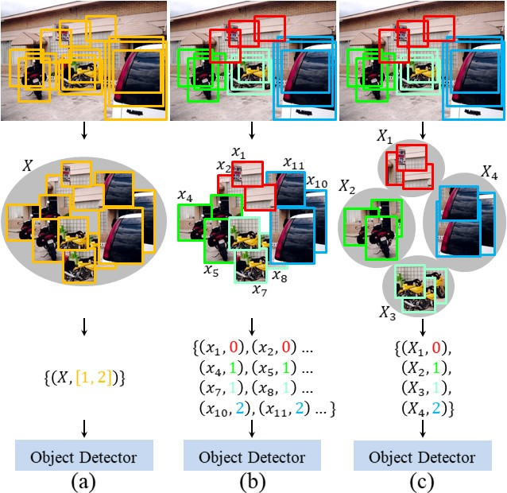
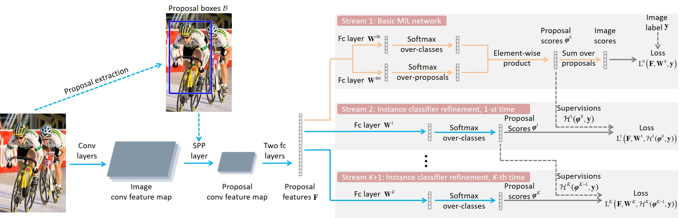
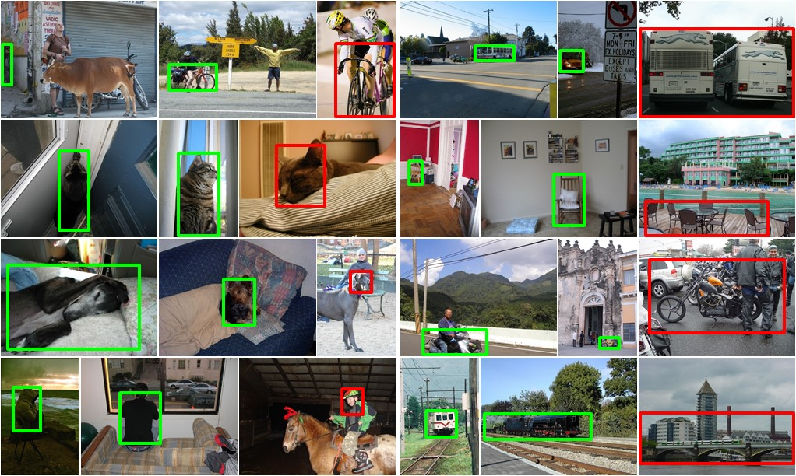

# PCL: Proposal Cluster Learning for Weakly Supervised Object Detection

By [Peng Tang](https://pengtang.xyz/), [Xinggang Wang](http://www.xinggangw.info/), [Song Bai](http://songbai.site/), [Wei Shen](https://shenwei1231.github.io/), [Xiang Bai](http://122.205.5.5:8071/~xbai/), [Wenyu Liu](http://mclab.eic.hust.edu.cn/MCWebDisplay/PersonDetails.aspx?Name=Wenyu%20Liu), and [Alan Yuille](http://www.cs.jhu.edu/~ayuille/).

This is a PyTorch implementation of our PCL/OICR. The original Caffe implementation of PCL/OICR is available [here](https://github.com/ppengtang/oicr).

The final performance of this implementation is ~~mAP 49.2% and CorLoc 65.0%~~ ***mAP 52.9% and CorLoc 67.2%*** using [vgg16_voc2007.yaml](configs/baselines/vgg16_voc2007.yaml) and ***mAP 54.1% and CorLoc 69.5%*** using [vgg16_voc2007_more.yaml](configs/baselines/vgg16_voc2007_more.yaml) on PASCAL VOC 2007 using a single VGG16 model. The results are comparable with the recent state of the arts.

Please check the [0.4.0](https://github.com/ppengtang/pcl.pytorch/tree/0.4.0) branch for the older version of codes.

Small trick to obtain better results on COCO: changing [this line of codes](https://github.com/ppengtang/pcl.pytorch/blob/master/lib/modeling/pcl_heads.py#L84) to `return 4.0 * loss.mean()`.

### Updates
- Use the [trick](http://pengtang.xyz/publications/0640-supp.pdf) proposed in our [ECCV paper](http://pengtang.xyz/publications/0640.pdf).
- Use OICR and train more iterations.
- Add bounding box regression / Fast R-CNN branch following [paper1](https://openaccess.thecvf.com/content_ECCV_2018/papers/Mingfei_Gao_C-WSL_Count-guided_Weakly_ECCV_2018_paper.pdf) and [paper2](https://arxiv.org/pdf/1911.12148.pdf).
- Support PyTorch 1.6.0 by changing codes of losses to pure PyTorch codes and using RoI-Pooling from [mmcv](https://github.com/open-mmlab/mmcv).
- Make the loss of first refinement branch 3x bigger following [paper3](https://arxiv.org/pdf/2004.04725.pdf), please check [here](https://github.com/NVlabs/wetectron/issues/3#issuecomment-674909989).
- For [vgg16_voc2007_more.yaml](configs/baselines/vgg16_voc2007_more.yaml), use one more image scale 1000 and train more iterations following [paper3](https://arxiv.org/pdf/2004.04725.pdf).

### Introduction

**Proposal Cluster Learning (PCL)** is a framework for weakly supervised object detection with deep ConvNets.
 - It achieves state-of-the-art performance on weakly supervised object detection (Pascal VOC 2007 and 2012, ImageNet DET, COCO).
 - Our code is written based on [PyTorch](https://pytorch.org/), [Detectron.pytorch](https://github.com/roytseng-tw/Detectron.pytorch), and [faster-rcnn.pytorch](https://github.com/jwyang/faster-rcnn.pytorch).

The original paper has been accepted by CVPR 2017. This is an extened version.
For more details, please refer to [here](https://arxiv.org/abs/1704.00138) and [here](https://arxiv.org/abs/1807.03342).

### Comparison with other methods
(a) Conventional MIL method;
(b) Our original OICR method with newly proposed proposal cluster generation method;
(c) Our PCL method.

<p align="left">


### Architecture

<p align="left">

</p>

### Visualizations

Some PCL visualization results.
<p align="left">

</p>

Some visualization comparisons among WSDDN, WSDDN+context, and PCL.
<p align="left">

</p>

### License

PCL is released under the MIT License (refer to the LICENSE file for details).

### Citing PCL

If you find PCL useful in your research, please consider citing:

    @article{tang2018pcl,
        author = {Tang, Peng and Wang, Xinggang and Bai, Song and Shen, Wei and Bai, Xiang and Liu, Wenyu and Yuille, Alan},
        title = {{PCL}: Proposal Cluster Learning for Weakly Supervised Object Detection},
        journal = {IEEE Transactions on Pattern Analysis and Machine Intelligence},
        volume = {},
        number = {},
        pages = {1--1},
        year = {2018}
    }

    @inproceedings{tang2017multiple,
        author = {Tang, Peng and Wang, Xinggang and Bai, Xiang and Liu, Wenyu},
        title = {Multiple Instance Detection Network with Online Instance Classifier Refinement},
        booktitle = {IEEE Conference on Computer Vision and Pattern Recognition},
        pages = {3059--3067},
        year = {2017}
    }

### Contents
1. [Requirements: hardware](#requirements-hardware)
2. [Basic installation](#installation)
3. [Installation for training and testing](#installation-for-training-and-testing)
4. [Extra Downloads (Models trained on PASCAL VOC)](#download-models-trained-on-pascal-voc)
5. [Usage](#usage)
6. [TODO](#what-we-are-going-to-do)

### Requirements: hardware

1. NVIDIA GTX 1080Ti (~11G of memory)

### Installation

1. Clone the PCL repository
  ```Shell
  git clone https://github.com/ppengtang/pcl.pytorch.git & cd pcl.pytorch
  ```

2. Install libraries
  ```Shell
  sh install.sh
  ```

### Installation for training and testing
1. Download the training, validation, test data and VOCdevkit

  ```Shell
  wget http://host.robots.ox.ac.uk/pascal/VOC/voc2007/VOCtrainval_06-Nov-2007.tar
  wget http://host.robots.ox.ac.uk/pascal/VOC/voc2007/VOCtest_06-Nov-2007.tar
  wget http://host.robots.ox.ac.uk/pascal/VOC/voc2012/VOCdevkit_18-May-2011.tar
  ```

2. Extract all of these tars into one directory named `VOCdevkit`

  ```Shell
  tar xvf VOCtrainval_06-Nov-2007.tar
  tar xvf VOCtest_06-Nov-2007.tar
  tar xvf VOCdevkit_18-May-2011.tar
  ```

3. Download the COCO format pascal annotations from [here](https://drive.google.com/drive/folders/1R4leOIYxP9qHJ2dVQJ4fKv2CoEHeEu41?usp=sharing) and put them into the `VOC2007/annotations` directory

4. It should have this basic structure

  ```Shell
  $VOC2007/                           
  $VOC2007/annotations
  $VOC2007/JPEGImages
  $VOC2007/VOCdevkit        
  # ... and several other directories ...
  ```

5. Create symlinks for the PASCAL VOC dataset

  ```Shell
  cd $PCL_ROOT/data
  ln -s $VOC2007 VOC2007
  ```
  Using symlinks is a good idea because you will likely want to share the same PASCAL dataset installation between multiple projects.

6. [Optional] follow similar steps to get PASCAL VOC 2012.

7. You should put the generated proposal data under the folder $PCL_ROOT/data/selective_search_data, with the name "voc_2007_trainval.pkl", "voc_2007_test.pkl". You can downlad the Selective Search proposals [here](https://drive.google.com/drive/folders/1dAH1oPZHKGWowOFVewblSQDJzKobTR5A?usp=sharing).

8. The pre-trained models are available at: [Dropbox](https://www.dropbox.com/s/s3brpk0bdq60nyb/vgg16_caffe.pth?dl=0), [VT Server](https://filebox.ece.vt.edu/~jw2yang/faster-rcnn/pretrained-base-models/vgg16_caffe.pth). You should put it under the folder $PCL_ROOT/data/pretrained_model.

### Download models trained on PASCAL VOC

Models trained on PASCAL VOC 2007 can be downloaded here: [Google Drive](https://drive.google.com/drive/folders/1OG56zqBv_gbLsDXySpLi55bYy5Q9Tf2-?usp=sharing).

### Usage

**Train** a PCL network. For example, train a VGG16 network on VOC 2007 trainval

  ```Shell
  CUDA_VISIBLE_DEVICES=0 python tools/train_net_step.py --dataset voc2007 \
    --cfg configs/baselines/vgg16_voc2007.yaml --bs 1 --nw 4 --iter_size 4
  ```
  or
  ```Shell
  CUDA_VISIBLE_DEVICES=0 python tools/train_net_step.py --dataset voc2007 \
    --cfg configs/baselines/vgg16_voc2007_more.yaml --bs 1 --nw 4 --iter_size 4
  ```
~~**Note: The current implementation has a bug on multi-gpu training and thus does not support multi-gpu training.**~~

**Test** a PCL network. For example, test the VGG 16 network on VOC 2007:

#### On trainval
  ```Shell
  CUDA_VISIBLE_DEVICES=0 python tools/test_net.py --cfg configs/baselines/vgg16_voc2007.yaml \
    --load_ckpt Outputs/vgg16_voc2007/$MODEL_PATH \
    --dataset voc2007trainval
  ```

#### On test
  ```Shell
  CUDA_VISIBLE_DEVICES=0 python tools/test_net.py --cfg configs/baselines/vgg16_voc2007.yaml \
    --load_ckpt Outputs/vgg16_voc2007/$model_path \
    --dataset voc2007test
  ```

Test output is written underneath `$PCL_ROOT/Outputs`.

**If your testing speed is very slow (> 5 hours on VOC 2007), try to add `torch.backends.cudnn.enabled = False` after [this line of codes](https://github.com/ppengtang/pcl.pytorch/blob/master/tools/test_net.py#L119). See [issue #45](https://github.com/ppengtang/pcl.pytorch/issues/45#issuecomment-759160617) for more details.**

~~**Note: Add `--multi-gpu-testing` if multiple gpus are available.**~~

#### Evaluation
For mAP, run the python code tools/reval.py
  ```Shell
  python tools/reeval.py --result_path $output_dir/detections.pkl \
    --dataset voc2007test --cfg configs/baselines/vgg16_voc2007.yaml
  ```

For CorLoc, run the python code tools/reval.py
  ```Shell
  python tools/reeval.py --result_path $output_dir/discovery.pkl \
    --dataset voc2007trainval --cfg configs/baselines/vgg16_voc2007.yaml
  ```

### What we are going to do

- [x] Add PASCAL VOC 2012 configurations.
- [x] Upload trained models.
- [x] Support multi-gpu training.
- [ ] Clean codes.
- [ ] Fix bugs for multi-gpu testing.

### Acknowledgements

We thank [Mingfei Gao](https://fly6464.github.io/), Yufei Yin, and Ke Yang for the help of improving this repo.
